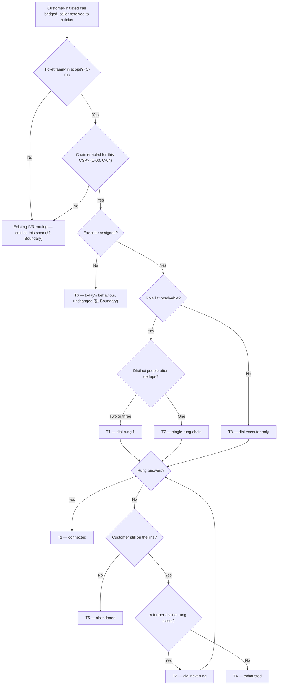

# IVR Escalation Chain — customer-initiated call routing

| | | | |
|---|---|---|---|
| **Owner** — Ashish Raj (PM) | **Reviewer** — Rahul (Eng Lead) | **Status** — Draft | **Sign-off** — Pending |
| **Version** — v0.4 · 4 Aug 2026 | | | |

---

## 1. Objective & Definition of Success

**Objective.** A customer who calls about their installation, restore or pickup ticket reaches a person at their own CSP — if the assigned executor does not answer, the call moves on by itself to that CSP's manager and then its owner, and the customer's chances of getting connected to a CSP user increase.

**Boundary.** This spec governs **customer-initiated** IVR calls on Install, Service (restore) and Pickup tickets for CSPs in the Phase-1 cohort (C-01, C-03). It leaves unchanged:

- **CSP-initiated calls** to customers — a separate PRD covers reaching the customer on a second number (AC-REG-1).
- **Calls on a ticket with no executor assigned** — today's behaviour stands, untouched (T6, AC-REG-2).
- **Bridge-rate behaviour** — caller identification, PIN entry and dead-end handling are governed by the existing IVR product spec and its Phase-1 RCA (AC-REG-3).
- **What the answering person is told about the call** — no ticket context, customer name or escalation indicator is delivered to any rung. Out of scope (AC-REG-4).
- **Ring durations** — how long each rung rings, and the total ringing a customer hears, are Exotel applet configuration, not parameters of this spec (see Overrides).

### Guardrails — promises that hold on every path

| ID | Guardrail | One line | Anchors |
|---|---|---|---|
| G1 | **Invisible escalation** | The chain advances on its own; the customer never presses a key, redials or is told to try again. | R1 · AC-GRD-1 · MQ-2 |
| G2 | **The executor is always first** | Every chain starts at the person assigned to the job, so escalation never becomes the normal route into a CSP. | R2 · AC-GRD-2 · MQ-3 · MQ-7 |
| G3 | **One dial per person** | No person is dialled twice in the same chain, however many roles they hold. | R3 · AC-GRD-3 · MQ-4 |
| G4 | **Never outside the ticket's CSP** | The chain only ever dials users of the CSP that owns the ticket — no other CSP's staff, no Wiom staff. | R6 · AC-GRD-4 · MQ-6 |

### Success metrics

Ticket-level connect rate is defined in §8. A ticket where the customer hung up before any rung answered **counts as not connected** (T5, MQ-5). All figures below are customer-initiated, Phase-1 cohort, 2 Jul – 3 Aug 2026.

| ID | Metric | Baseline | Target | Source |
|---|---|---|---|---|
| M1 | Ticket-level connect rate — **Service** (restore) | 50.2% | 69.0% | MQ-1 |
| M2 | Ticket-level connect rate — **Pickup** | 51.1% | 69.0% | MQ-1 |
| M3 | Ticket-level connect rate — **Install** | 69.0% | ≥ 69.0% — any gain is upside; a fall below baseline is a regression ⚠️ *AI GENERATED — review* | MQ-1 |
| M4 | Share of in-scope tickets that connect at **rung 1** — the assigned executor | 50.2% Service · 51.1% Pickup · 69.0% Install — today every connect is the executor, because there is no second rung | No family falls below its own baseline | MQ-3 |

**Where the 69.0% comes from, and why it does not move.** 69.0% is what install tickets achieved on customer-initiated calls in the window above — **before** this spec ships. It is the closest thing to a ceiling this direction is known to reach, so Service and Pickup aim at it. It is frozen as a historical mark: install is itself in scope (C-01), so install's own rate should climb past 69.0% and must not be allowed to redefine M1 and M2's target as it does. The benchmark is also direction-matched on purpose — install's all-directions figure (79.6%) mixes in CSP-initiated calls, and its CSP-initiated figure (75.8%) belongs to the customer-side PRD, so neither can be used here.

Install has the least room to gain of the three families, and that is expected. It is in scope because the chain costs nothing extra to apply there and any gain is worth having.

**M4 is the counter-metric for M1, M2 and M3.** Connect rate rising while M4 falls means executors have stopped answering and managers and owners are absorbing the calls — connect rate would improve while service got worse, because an owner answering does not restore anyone's line.

**Do not derive the targets from independence.** Three rungs each answering at ~50% gives 87.5% only if the three failures are unrelated. If a common cause suppresses all three, the chain moves connect rate very little. MQ-3 measures per-rung answer rate so this is known within a month of launch rather than assumed.

**Invariant (not a metric):** G2 — chains where an assigned executor was not rung 1 = 0, zero tolerance. Monitored via MQ-7, not trended.

**Invariant (not a metric):** G4 — people dialled who do not belong to the ticket's CSP = 0, zero tolerance. Monitored via MQ-6, not trended.

---

## 2. User Stories & Rules

| ID | Story | MUST | MUST NOT |
|---|---|---|---|
| R1 | As a customer whose internet is down, when I call about my ticket I want to reach *someone* at my provider, not hear ringing and give up. | **(a)** Advance to the next rung by itself when the current rung does not answer. **(b)** Bridge the call to the first rung that answers. | **(a)** Ask the customer to press a key, hold, redial or call another number. **(b)** Tell the customer that escalation is happening or which rung is ringing. |
| R2 | As a CSP owner, I want the person actually assigned to the job to get the call first, so escalation stays the exception. | Dial the assigned executor as rung 1 on every chain, whatever role that person holds (G2). | Skip, reorder or bypass the executor when one is assigned and has a number. |
| R3 | As a CSP owner who is also the executor on my own jobs, I do not want my phone rung three times for one call. | Dial each distinct person once; where two or three rungs resolve to the same person, shorten the chain (G3). | Dial the same person more than once in one chain. |
| R4 | As a customer at a CSP that has no manager, I still want the chain to reach the owner. | Skip a rung that has no user or no number, and continue to the next rung that exists. | Fail, end or shorten the call because a rung is vacant. |
| R5 | As an executor who missed a call, I want the next call on that ticket to reach me first. | Treat every inbound call as a new chain that starts at the executor. | Resume a later call part-way down the chain, or remember which rungs already failed. |
| R6 | As a customer, I want my ticket discussed only with people at my own provider. | Restrict every rung to users of the CSP that owns the ticket (G4). | Dial another CSP's users, a Wiom call centre, or any number not held against this CSP. |
| R7 | As a customer whose line dies at night, I want the chain to work then too. | Run the full chain at every hour of the day, every day. | Suppress, shorten or delay the chain outside working hours. |

---

## 3. System Behaviour

### 3a. System flow chart

**Precedence — customer hangup beats escalation.** If the customer disconnects while a rung is ringing, the chain ends there and no further rung is dialled (T5, AC-RACE-1).

**Precedence — first answer wins.** If a rung answers at the same instant the chain advances, the call bridges to the rung that answered and the other dial is dropped; the customer is never bridged to two people (T2, AC-RACE-2).

**Precedence — a ticket closing mid-chain does not stop it.** A chain already ringing when its ticket closes runs to completion; ticket closure is evaluated at caller resolution, not per rung (AC-RACE-3). ⚠️ *AI GENERATED — review*

### 3b. State transition table — canon

Lifecycle of an **escalation chain** (created when a customer-initiated call is bridged and the caller resolves to an in-scope ticket). **Each inbound call creates its own chain; no state carries between calls (R5).** The ticket's own lifecycle, the caller-identification and PIN flow, and the CSP-initiated call direction are out of scope; they appear only where a chain is affected.

| ID | From | Action / Trigger | Rule / Check | To | Side-effects |
|---|---|---|---|---|---|
| T1 | — | Customer-initiated call bridged, caller resolved to an in-scope ticket | Ticket family in C-01; chain enabled (C-03, C-04); executor assigned with a number; role list resolves to 2 or 3 distinct people after dedupe (R3) and after skipping vacant rungs (R4) | Ringing rung 1 | Assigned executor dialled (R2, G2). Chain length after dedupe recorded (MQ-4). |
| T2 | Ringing rung N | The ringing rung answers | — | Connected | Call bridged to that person (R1b). Answering rung index recorded (MQ-2, MQ-3). Terminal state. |
| T3 | Ringing rung N | The ringing rung does not answer, is busy, or the dial fails | A further distinct rung exists | Ringing rung N+1 | Next distinct person dialled (R3), and not before the current rung's dial has finished unanswered. No customer action and no announcement (R1a, R1 must-not(b), G1). |
| T4 | Ringing rung N | The ringing rung does not answer, is busy, or the dial fails | No further rung exists | Exhausted | Existing unconnected-call handling applies, unchanged (§1 Boundary). Ticket counted as not connected (M1, M2, M3, MQ-5). Terminal state. |
| T5 | Ringing rung N | Customer disconnects | — | Abandoned | Chain ends immediately; no further rung is dialled. Ticket counted as not connected (M1, M2, M3, MQ-5). Terminal state. |
| T6 | — | Customer-initiated call bridged, caller resolved to an in-scope ticket | No executor assigned to the ticket | Outside this spec | Today's routing runs unchanged; no chain is created (§1 Boundary, AC-REG-2). |
| T7 | — | Customer-initiated call bridged, caller resolved to an in-scope ticket | Executor, manager-tier user and owner resolve to one person after dedupe (R3) | Ringing rung 1 | That person dialled once (G3). No answer routes to T4, not T3. |
| T8 | — | Customer-initiated call bridged, caller resolved to an in-scope ticket | Role list cannot be resolved | Ringing rung 1 | **Failure envelope:** the call is never failed for want of a role list — it degrades to dialling the assigned executor alone, which is today's behaviour. No answer routes to T4. How resolution is retried inside the call is the implementer's. ⚠️ *AI GENERATED — review* |

---

## 4. Screen Requirements

**Not applicable — this feature has no screen.** The whole call happens on the phone network, and G1 requires the escalation be invisible: R1's must-not bars any announcement, indicator or customer action. The Customer App, CSP App and Technician App are all untouched (AC-GRD-1). Ticket context for the answering rung is out of scope (§1 Boundary, AC-REG-4).

No design file is needed, because there is nothing to design.

§6 states what the shipped system must be able to answer. Where those answers are read — dashboard, report or query — is the implementer's, not this spec's.

---

## 5. Configurability

| ID | Parameter | Default | Range | Who changes it |
|---|---|---|---|---|
| C-01 | Ticket families the chain applies to (T1) | Install, Service, Pickup | Any subset of the ticket families the IVR serves | Product |
| C-02 | Rung order and the role at each rung (R2, T1) | Rung 1 assigned executor · rung 2 manager-tier user · rung 3 owner | Fixed in V1 | Product |
| C-03 | CSP cohort the chain is active for (T1) | Phase-1 cohort (99 CSPs) | Any set of CSPs | Product |
| C-04 | Chain enabled — kill switch (T1) | On, for the C-03 cohort | On / Off | Product + Eng ⚠️ *AI GENERATED — review* |

**No window interaction note applies.** This spec owns no clocks. Per-rung ring duration and the total ringing a customer hears are Exotel applet configuration and deliberately not C-ids (see Overrides), so there are no two windows here to specify a state between. Customer wait is still measured — MQ-8 — because it is the abandonment risk this design carries.

---

## 6. Measurement

| ID | The system must be able to answer… | Feeds |
|---|---|---|
| MQ-1 | Of in-scope tickets with at least one customer-initiated call, what share had at least one call where a person answered — split by ticket family. Abandoned chains count as not connected. | M1 · M2 · M3 |
| MQ-2 | For each chain, which rung answered — 1, 2, 3, or none — and whether that answer happened on the same inbound call the customer made. | G1 · M4 |
| MQ-3 | For each rung, the share of dials to that rung that were answered. | M4 · G2 · the independence check in §1 |
| MQ-4 | How many chains were shortened by dedupe, and to what length. | G3 · R3 |
| MQ-5 | How many chains ended Connected, Exhausted or Abandoned. | M1, M2, M3 definition · T4 · T5 |
| MQ-6 | Whether any person dialled in a chain did not belong to the ticket's CSP. | G4 invariant (R6) |
| MQ-7 | Whether any chain dialled a rung other than the assigned executor first, where an executor was assigned and had a number. | G2 invariant (R2) |
| MQ-8 | The time from bridge to answer or to customer disconnect, by the rung reached. ⚠️ *AI GENERATED — review* | Abandonment risk behind M1, M2, M3 · R7 |

---

## 7. Acceptance Criteria

**Example data used throughout** ⚠️ *AI GENERATED — review* — CSP `CSP-4412`: technician Ravi (09811100011), Manager Anil (09811100012), Owner Suresh (09811100013). Service ticket `TKT-88231` for customer Meena (09811100022), with Ravi as its assigned executor. Calls on 12 Aug 2026.

### CHN — Chain creation and rung 1 (T1, T7, T8)

| AC | Given / When / Then | Verifies | Status |
|---|---|---|---|
| AC-CHN-1 | **Given** `TKT-88231` with Ravi as executor and Anil and Suresh on `CSP-4412`, **When** Meena calls at 15:20 and is resolved to that ticket, **Then** a chain of 3 rungs exists and Ravi's 09811100011 is the first and only number dialled. | R2 · T1 · G2 | Settled |
| AC-CHN-2 | **Given** `TKT-88231` where Suresh is both the owner and its assigned executor, and Anil is the manager, **When** Meena calls, **Then** the chain has 2 rungs — Suresh then Anil — and 09811100013 is dialled exactly once. | R3 · T1 · G3 | Settled |
| AC-CHN-3 | **Given** `CSP-4412` with no manager-tier user and no Manager Plus, **When** Meena calls, **Then** the chain has 2 rungs — Ravi then Suresh — and no dial is attempted against a vacant rung. | R4 · T1 | Settled |
| AC-CHN-4 | **Given** a CSP where the executor, manager and owner are all Suresh, **When** Meena calls, **Then** the chain has exactly 1 rung, 09811100013 is dialled once, and on no answer the chain ends Exhausted rather than advancing. | R3 · T7 · G3 | Settled |
| AC-CHN-5 | **Given** Ravi is the executor on `TKT-88231` but has no phone number on `CSP-4412`, **When** Meena calls, **Then** rung 1 is skipped without a dial and Anil's 09811100012 is dialled first. | R4 · T1 | Settled |
| AC-CHN-6 | **Given** a Pickup ticket for Meena at `CSP-4412`, **When** she calls, **Then** the chain is created — Pickup is in scope (C-01). | C-01 · T1 | Settled |
| AC-CHN-7 | **Given** `TKT-88231` where Anil the manager is its assigned executor, **When** Meena calls, **Then** the chain has 2 rungs — Anil then Suresh — and Anil's 09811100012 is dialled first, not Ravi's. | R2 · R3 · T1 · G2 | Settled |
| AC-CHN-8 | **Given** an install ticket for Meena at `CSP-4412` with Ravi as executor, **When** she calls, **Then** the chain is created — install is in scope (C-01). | C-01 · T1 | Settled |

### ESC — Escalation and connection (T2, T3)

| AC | Given / When / Then | Verifies | Status |
|---|---|---|---|
| AC-ESC-1 | **Given** the 3-rung chain from AC-CHN-1 with Ravi ringing, **When** Ravi answers, **Then** Meena is bridged to Ravi, no further number is dialled, and the answering rung is recorded as 1. | R1b · T2 · MQ-2 | Settled |
| AC-ESC-2 | **Given** the same chain, **When** Ravi does not answer, **Then** Anil's 09811100012 is dialled next without Meena pressing any key, hearing any announcement, or the call dropping. | R1a · T3 · G1 | Settled |
| AC-ESC-3 | **Given** Anil is then ringing, **When** Anil answers, **Then** Meena is bridged to Anil, Suresh is never dialled, and the answering rung is recorded as 2. | R1b · T2 · T3 | Settled |
| AC-ESC-4 | **Given** Anil is ringing, **When** Anil's line is busy, **Then** the chain advances to Suresh — busy is treated the same as no answer. | T3 | Settled |
| AC-ESC-5 | **Given** Anil is ringing, **When** the dial to Anil fails outright, **Then** the chain advances to Suresh rather than ending. | T3 | Settled |
| AC-ESC-6 | **Given** the chain has reached Suresh, **When** Suresh answers, **Then** Meena is bridged to Suresh and the answering rung is recorded as 3. | T2 · MQ-2 | Settled |
| AC-ESC-7 | **Given** the 3-rung chain from AC-CHN-1, **When** Ravi's phone is ringing, **Then** neither Anil's nor Suresh's phone has rung — the rungs are dialled one after another, never together. | R2 · T3 · G2 | Settled |

### END — Chain endings (T4, T5)

| AC | Given / When / Then | Verifies | Status |
|---|---|---|---|
| AC-END-1 | **Given** the 3-rung chain with Suresh ringing as rung 3, **When** Suresh does not answer, **Then** the chain ends Exhausted, existing unconnected-call handling runs unchanged, and `TKT-88231` counts as not connected. | T4 · M1 · MQ-5 | Settled |
| AC-END-2 | **Given** Anil is ringing as rung 2, **When** Meena hangs up, **Then** the chain ends Abandoned, Suresh is never dialled, and `TKT-88231` counts as not connected. | T5 · M1 · MQ-5 | Settled |
| AC-END-3 | **Given** the single-rung chain from AC-CHN-4, **When** Suresh does not answer, **Then** the chain ends Exhausted after one dial. | T7 · T4 | Settled |

### WF — Workflows (T1 → T3 → T2; T1 → T3 → T4)

| AC | Given / When / Then | Verifies | Status |
|---|---|---|---|
| AC-WF-1 | **Given** `TKT-88231` with Ravi as executor, Anil and Suresh, **When** Meena calls at 15:20, Ravi does not answer and Anil does, **Then** Meena has spoken to Anil on one call, was never asked to redial or press a key, and `TKT-88231` counts as connected at rung 2. | R1 · T1 · T3 · T2 · G1 | Settled |
| AC-WF-2 | **Given** the same setup, **When** none of Ravi, Anil or Suresh answers, **Then** exactly three numbers were dialled in that order, the chain ends Exhausted, and `TKT-88231` counts as not connected. | T1 · T3 · T4 · M1 | Settled |
| AC-WF-3 | **Given** Meena's call at 15:20 ended Exhausted, **When** she calls again at 15:45, **Then** a new chain starts at Ravi — not at Anil or Suresh. | R5 · T1 | Settled |

### FAIL — Failure envelopes (T8)

| AC | Given / When / Then | Verifies | Status |
|---|---|---|---|
| AC-FAIL-1 | **Given** the source of CSP roles cannot be reached when Meena calls, **When** the call is bridged, **Then** Ravi alone is dialled — the call is bridged, never failed or dropped for want of a role list. | T8 | Settled |
| AC-FAIL-2 | **Given** the same failure and Ravi does not answer, **When** the dial completes unanswered, **Then** the chain ends Exhausted and existing unconnected-call handling runs — no rung 2 is invented. | T8 · T4 | Settled |

### REG — Regression (§1 Boundary)

| AC | Given / When / Then | Verifies | Status |
|---|---|---|---|
| AC-REG-1 | **Given** `TKT-88231`, **When** Ravi calls Meena from the CSP App, **Then** routing is exactly as before this spec — one destination, Meena's registered number, no chain. | §1 Boundary | Settled |
| AC-REG-2 | **Given** a Service ticket at `CSP-4412` with no executor assigned, **When** Meena calls, **Then** routing is exactly as before this spec and no chain is created. | T6 · §1 Boundary | Settled |
| AC-REG-3 | **Given** Meena calls the masked number and enters a wrong PIN, **When** the call reaches the dead end, **Then** the existing caller-identification and dead-end behaviour is unchanged — this spec begins only after a caller resolves to a ticket. | §1 Boundary | Settled |
| AC-REG-4 | **Given** Anil answers as rung 2 on `TKT-88231`, **When** the call bridges, **Then** Anil receives no ticket reference, customer name or escalation indicator — unchanged from today. | §1 Boundary | Settled |

### RACE — Simultaneity (§3a precedence rules)

| AC | Given / When / Then | Verifies | Status |
|---|---|---|---|
| AC-RACE-1 | **Given** Anil's phone is ringing as rung 2, **When** Meena hangs up at the same instant the chain would advance to Suresh, **Then** Suresh is not dialled and the chain ends Abandoned. | T5 · precedence 1 | Settled |
| AC-RACE-2 | **Given** the chain is advancing from Anil to Suresh, **When** Anil answers at that same instant, **Then** Meena is bridged to exactly one person and is never on a call with both. | T2 · precedence 2 | Settled |
| AC-RACE-3 | **Given** Anil is ringing as rung 2 on `TKT-88231`, **When** `TKT-88231` is closed at that instant, **Then** the chain continues to completion and Meena is still bridged if Anil answers. | precedence 3 | Settled |

### DUP — Duplicate triggers

| AC | Given / When / Then | Verifies | Status |
|---|---|---|---|
| AC-DUP-1 | **Given** Meena calls at 15:20 and is bridged to Anil at rung 2, **When** she calls again at 15:22, **Then** a second, independent chain starts at Ravi. | R5 · T1 | Settled |
| AC-DUP-2 | **Given** Meena has two calls in flight on the same ticket at once, **When** both chains run, **Then** each chain dials its own rungs independently and neither shortens or skips because of the other. | R5 · T1 | Settled |
| AC-DUP-3 | **Given** two different customers of `CSP-4412` call at the same moment on two Service tickets both assigned to Ravi, **When** both chains start, **Then** both dial Ravi as rung 1 and each advances on its own outcome. | R2 · T1 · T3 | Settled |

### BV — Boundary values (chain length)

| AC | Given / When / Then | Verifies | Status |
|---|---|---|---|
| AC-BV-1 | **Given** a CSP resolving to exactly 1 distinct person, **When** Meena calls, **Then** 1 dial is made and no escalation occurs. | R3 · T7 | Settled |
| AC-BV-2 | **Given** a CSP resolving to exactly 2 distinct people, **When** neither answers, **Then** exactly 2 dials were made and the chain ends Exhausted — no third dial. | R3 · R4 · T4 | Settled |
| AC-BV-3 | **Given** a CSP resolving to 3 distinct people, **When** none answers, **Then** exactly 3 dials were made and no fourth rung exists — the chain never extends past the owner. | C-02 · T4 | Settled |

### CFG — Configurability

| AC | Given / When / Then | Verifies | Status |
|---|---|---|---|
| AC-CFG-1 | **Given** `CSP-4412` is removed from the active cohort (C-03), **When** Meena calls, **Then** only Ravi is dialled and no escalation occurs. | C-03 | Settled |
| AC-CFG-2 | **Given** the chain is switched off (C-04), **When** Meena calls, **Then** routing is identical to AC-REG-2's pre-spec behaviour for every in-scope ticket. | C-04 | Settled |
| AC-CFG-3 | **Given** Pickup is removed from C-01, **When** Meena calls on a Pickup ticket, **Then** no chain is created, while her Service ticket still gets one. | C-01 | Settled |

### GRD — Guardrails

| AC | Given / When / Then | Verifies | Status |
|---|---|---|---|
| AC-GRD-1 | **Given** any chain that reaches rung 2 or rung 3, **When** the call is reviewed end to end, **Then** the customer heard no announcement, pressed no key, and the call was never disconnected and re-established. | G1 · R1 | Settled |
| AC-GRD-2 | **Given** 1,000 chains across the cohort, **When** the first dial of each is checked, **Then** every one dialled the assigned executor where an executor was assigned and had a number — whatever role that executor held. | G2 · R2 · MQ-7 | Settled |
| AC-GRD-3 | **Given** any chain at a CSP where one person is both the executor and a later rung, **When** the dial list is checked, **Then** no person appears twice. | G3 · R3 · MQ-4 | Settled |
| AC-GRD-4 | **Given** any chain on `TKT-88231`, **When** every number dialled is checked against `CSP-4412`'s user list, **Then** all of them belong to `CSP-4412` and none is a Wiom or other-CSP number. | G4 · R6 · MQ-6 | Settled |
| AC-GRD-5 | **Given** a Service ticket where Meena calls at 23:40, **When** Ravi does not answer, **Then** the chain advances to Anil and then Suresh exactly as it would at 15:20. | R7 | Settled |

---

## 8. Glossary

| Term | Meaning | Owner (domain) |
|---|---|---|
| Assigned executor | **Canonical definition:** the partner user assigned to carry out a ticket. Any role can be the executor — owner, Manager, Manager Plus or technician — so the executor's role is not fixed, and the executor may also be a later rung, in which case dedupe shortens the chain (R3). Always rung 1 (C-02, G2). | Partner Platform |
| Escalation chain | **Canonical definition:** the ordered list of distinct people dialled for one inbound customer call, and the act of moving down it when a person does not answer. Created per call, never carried between calls (R5). Carries: the ticket it belongs to, the ordered rungs after dedupe, the chain length, the answering rung index if any, and the end state (Connected / Exhausted / Abandoned). | — |
| Rung | One position in an escalation chain, and the one person dialled at that position. Rung 1 is the assigned executor, rung 2 the manager-tier user, rung 3 the owner (C-02). | — |
| Manager-tier user | The CSP user holding the Manager or the Manager Plus role. A CSP cannot hold both at once by design, so this is always at most one person, and rung 2 is whichever of the two exists. | Partner Platform |
| Ticket-level connect rate | **Canonical definition:** of tickets that had at least one call in the chosen direction and window, the share where at least one of those calls was answered by a person. A ticket counts once however many calls it had. Not to be confused with call-level connect rate, which is per call. Comparisons must never mix the two grains. | — |
| Exhausted | A chain where every rung was dialled and none answered. Counts as not connected. | — |
| Abandoned | A chain where the customer disconnected before any rung answered. Counts as not connected. | — |
| Install ticket | The new-connection installation ticket family. | — |
| Service ticket | The restore ticket family — a live customer whose connection needs restoring. Called "Service" in the ops dashboard's ticket-type filter. | — |
| Pickup ticket | The netbox-recovery (NBREC) ticket family — collecting equipment from a customer. | — |
| Phase-1 cohort | The 99 CSPs on which IVR 2.0 is live, and this spec's launch scope (C-03). | — |

---

## 9. Notes for System Capabilities

What the platform must be able to do for this feature to exist. Whether these are one system or several, and how they interact, is the implementer's design.

| Capability | Needed by |
|---|---|
| For a ticket, resolve its assigned executor whatever role that person holds, plus the CSP's manager-tier user and its owner, each with a dialable number, restricted to that CSP. | T1 · R2 · R4 · R6 · G4 |
| Reduce a resolved rung list to distinct people before any dial, preserving rung order. | T1 · T7 · R3 · G3 |
| Dial an ordered list of destinations for one inbound call, advancing to the next on no answer, busy or dial failure, without the caller acting and without dropping the call. | T1 · T3 · R1 · G1 |
| End a chain the moment the caller disconnects, dialling nothing further. | T5 · precedence 1 |
| Bridge to exactly one person per call, even when an answer and an advance coincide. | T2 · precedence 2 |
| Fall back to dialling the assigned executor alone when the rung list cannot be resolved, without failing the call. | T8 |
| Record, per call, the chain length after dedupe, the rung that answered if any, the end state, and the caller's wait before answer or hangup. | MQ-2 · MQ-3 · MQ-4 · MQ-5 · MQ-8 |
| Turn the chain on or off, and vary its ticket families and CSP cohort, without a release. | C-01 · C-03 · C-04 |

---

## AI-generated content for review

| Location | What was generated | Basis |
|---|---|---|
| §1 M3 target | "≥ 69.0% — any gain is upside; a fall below baseline is a regression" | PM said install is in scope because any extra gain is welcome, which implies no committed target. The no-regression floor is inferred, not stated. |
| §3a precedence 3 | A ticket closing mid-chain does not stop the chain | Default. Not discussed; the alternative (yanking a ringing call) seemed clearly worse. |
| §3b T8 | Failure envelope — degrade to executor-only when the rung list cannot be resolved | Default. PM did not state behaviour when the role lookup fails. |
| §5 C-04 | Kill switch, and Eng as joint owner | Default. No rollback control was discussed; a cohort-wide behaviour change normally needs one. |
| §6 MQ-8 | Customer wait before answer or hangup | Inferred. Ring durations are out of scope, but the abandonment risk they create still needs measuring. |
| §7 | The whole example dataset — `CSP-4412`, Ravi, Anil, Suresh, Meena, `TKT-88231`, the numbers and the 12 Aug 2026 date | Invented. ACs need concrete data to be executable. Replace with a real CSP and ticket if you want these runnable as-is. |

---

## Overrides

| Rule | What was done instead | Rationale | Approved by |
|---|---|---|---|
| §5 — every number that could change gets a C-id, including customer-experience latency targets even where engineering owns them | Per-rung ring duration and the total ringing the customer hears are **not** C-ids and appear nowhere in §5 | Ring behaviour is Exotel App Bazaar applet configuration, not a parameter of this service. Consistent with the June 2026 decision to drop `ES_CSPIVR_CALL_BRIDGE_MAX_RING_SECONDS` from the IVR spec for the same reason. Customer wait is still measured via MQ-8. | Ashish Raj (PM), 3 Aug 2026 |
| Header — name consulted parties by domain | No consulted parties are named; the header carries Owner, Reviewer, Status, Sign-off and Version only | PM removed all three consulted slots. The spec changes no other team's surface: it reads existing partner-role data and dials through the existing telephony integration. | Ashish Raj (PM), 3 Aug 2026 |
| §4 — one block per screen the feature touches, internal screens included, each with states, freshness, an elements table and a design link | §4 carries no screen block at all — only a statement that the feature has no screen | The feature is invisible by design (G1), so no app screen changes. An internal ops view was drafted and removed at the PM's instruction: §6 already states what the system must answer, and where those answers are read is the implementer's. | Ashish Raj (PM), 4 Aug 2026 |
| §1 — "what does the customer see between two windows" | No in-between state specified | This spec owns no clocks, so no gap between windows exists. | Ashish Raj (PM), 3 Aug 2026 |
